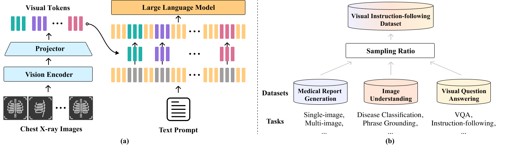
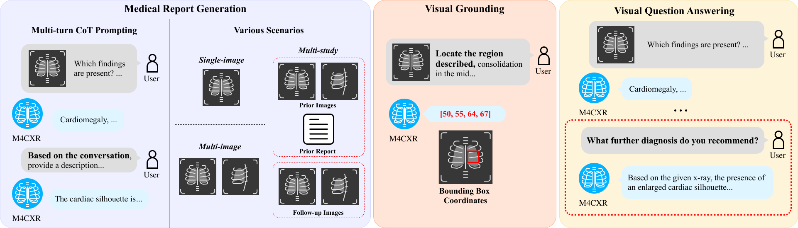

# M4CXR: Exploring Multi-task Potentials of Multi-modal Large Language Models for Chest X-ray Interpretation
> Official PyTorch implementation of the following paper:\
> M4CXR: Exploring Multi-task Potentials of Multi-modal Large Language Models for Chest X-ray Interpretation\
> DEEPNOID Inc.

### Overview
<p align="center"></p>
<p align="center"></p>

We propose M4CXR, an MLLM designed for CXR interpretation, capable of handling multiple tasks. To enable multi-task learning, we assemble a visual instruction-following dataset from diverse CXR tasks. By adopting a novel CoT reasoning process, M4CXR achieves state-of-the-art clinical accuracy in CXR report generation.M4CXR effectively utilizes multiple images and reports, allowing for its applicability across different scenarios. Beyond MRG, M4CXR demonstrates remarkable performance in visual grounding and VQA.

### Environment
```bash
pip install -r requirements.txt
```

### Data Preparation
Download datasets and preprocess with codes.
(TBA)

### Pretraining
```bash
PYTHONPATH=. torchrun --nproc_per_node=2 --nnodes=1 exp/cxr_llm/run.py --add_cfg_list mrg amp_bf16 pre_training_abstractor paths
```

### Visual instruction tuning

```bash
PYTHONPATH=. torchrun --nproc_per_node=2 --nnodes=1 exp/cxr_llm/run.py --add_cfg_list mrg iu vqa amp_bf16 instruction_tuning paths
```

### LICENSE
[](https://creativecommons.org/licenses/by-nc/4.0/)
