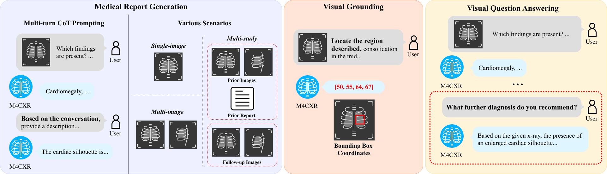
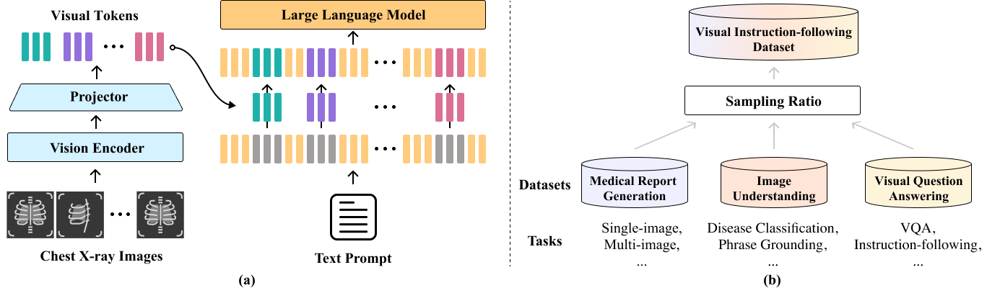

# M4CXR: Exploring Multi-task Potentials of Multi-modal Large Language Models for Chest X-ray Interpretation [IEEE TNNLS]

<p align="center">
📝 <a href="https://arxiv.org/abs/2408.16213" target="_blank">arXiv</a> •
📖 <a href="https://ieeexplore.ieee.org/abstract/document/11106750" target="_blank">IEEE TNNLS</a> •
🤗 <a href="https://huggingface.co/Deepnoid/M4CXR-TNNLS" target="_blank">Model</a> •
🧩 <a href="https://github.com/deepnoid-ai/M4CXR-TNNLS" target="_blank">Codes</a>
</p>

## Introduction

<p align="center"></p>

<p align="center"></p>

We propose **M4CXR**, a multi-modal large language model (MLLM) designed for chest X-ray (CXR) interpretation, capable of handling **multiple tasks** in a unified conversational framework. To enable multi-task learning, we assemble a visual instruction-following dataset from diverse CXR tasks. By adopting a novel **chain-of-thought (CoT)** reasoning process, M4CXR achieves state-of-the-art clinical accuracy in CXR report generation. M4CXR effectively utilizes multiple images and prior reports, allowing for its applicability across diverse clinical scenarios. Beyond medical report generation (MRG), M4CXR demonstrates remarkable performance in **visual grounding** and **visual question answering (VQA)**.

## Abstract

> The rapid evolution of artificial intelligence, especially in large language models (LLMs), has significantly impacted various domains, including healthcare. In chest X-ray (CXR) analysis, previous studies have employed LLMs, but with limitations: either underutilizing the LLMs' capability for multitask learning or lacking clinical accuracy. This article presents M4CXR, a multimodal LLM designed to enhance CXR interpretation. The model is trained on a visual instruction-following dataset that integrates various task-specific datasets in a conversational format. As a result, the model supports multiple tasks such as medical report generation (MRG), visual grounding, and visual question answering (VQA). M4CXR achieves state-of-the-art clinical accuracy in MRG by employing a chain-of-thought (CoT) prompting strategy, in which it identifies findings in CXR images and subsequently generates corresponding reports. The model is adaptable to various MRG scenarios depending on the available inputs, such as single-image, multiimage, and multistudy contexts. In addition to MRG, M4CXR performs visual grounding at a level comparable to specialized models and demonstrates outstanding performance in VQA. Both quantitative and qualitative assessments reveal M4CXR's versatility in MRG, visual grounding, and VQA, while consistently maintaining clinical accuracy.

## Updates

- `2026-04-18`: Model checkpoints of M4CXR have been released on [🤗 Hugging Face](https://huggingface.co/Deepnoid/M4CXR-TNNLS). 🚀
- `2025-08-01`: **M4CXR** has been published in [IEEE Transactions on Neural Networks and Learning Systems (TNNLS)](https://ieeexplore.ieee.org/abstract/document/11106750). 🎉

## M4CXR Model Inference

The pretrained model is hosted on 🤗 Hugging Face: [Deepnoid/M4CXR-TNNLS](https://huggingface.co/Deepnoid/M4CXR-TNNLS).

### Install dependencies

```bash
pip install -r requirements.txt
```

### Basic Inference

```python
import torch
from transformers import AutoModelForCausalLM, AutoProcessor, GenerationConfig

from interface import do_generate, load_image_from_url


# Load processor, model, and generation config
processor = AutoProcessor.from_pretrained("Deepnoid/M4CXR-TNNLS", trust_remote_code=True)
generation_config = GenerationConfig.from_pretrained("Deepnoid/M4CXR-TNNLS")
model = AutoModelForCausalLM.from_pretrained(
    "Deepnoid/M4CXR-TNNLS",
    trust_remote_code=True,
    torch_dtype=torch.bfloat16,
    device_map="cuda",
)

# Prepare inputs
image = load_image_from_url(
    "https://upload.wikimedia.org/wikipedia/commons/a/a1/Normal_posteroanterior_%28PA%29_chest_radiograph_%28X-ray%29.jpg"
)
question = "radiology image: <image> What is the view of this chest X-ray?"
prompt = processor.apply_chat_template(
    [{"role": "user", "content": question}], tokenize=False
)

# Generate
generation_config.do_sample = False
outputs = do_generate([prompt], [image], model, processor, generation_config)
print(outputs)
```

### Task-specific Usage

M4CXR supports a wide range of CXR interpretation tasks through multi-turn conversations and CoT prompting. See [task_examples.py](https://huggingface.co/Deepnoid/M4CXR-TNNLS/blob/main/task_examples.py) on the Hugging Face model hub for runnable examples, including:

- **Single-image medical report generation** (CoT prompting)
- **Multi-image medical report generation** (CoT prompting)
- **Multi-study medical report generation** with prior images/reports (CoT prompting)
- **Visual grounding** (bounding-box prediction from a phrase)
- **Report summarization**

## Training

### Data Preparation

Download the datasets listed below and preprocess them using the scripts under [preprocess/](preprocess).

- **Medical report generation / classification**: [MIMIC-CXR](https://physionet.org/content/mimic-cxr/2.1.0/), [BraX](https://physionet.org/content/brax/1.1.0/), [CheXpert](https://stanfordmlgroup.github.io/competitions/chexpert/), [ChestX-ray14 (NIH)](https://nihcc.app.box.com/v/ChestXray-NIHCC), [PadChest](https://bimcv.cipf.es/bimcv-projects/padchest/), [VinDr-CXR](https://vindr.ai/datasets/cxr), [Open-I (IU X-ray)](https://openi.nlm.nih.gov/)
- **Visual grounding**: [Chest ImaGenome](https://physionet.org/content/chest-imagenome/1.0.0/), [ChestX-Det10](https://github.com/Deepwise-AILab/ChestX-Det10-Dataset), [MS-CXR](https://physionet.org/content/ms-cxr/0.1/)
- **Visual question answering**: [MIMIC-Diff-VQA](https://physionet.org/content/medical-diff-vqa/1.0.0/)
- **Segmentation / localization (auxiliary)**: [CheXlocalize](https://stanfordaimi.azurewebsites.net/datasets/23c56a0d-15de-405b-87c8-99c30138950c), [SIIM-ACR Pneumothorax](https://www.kaggle.com/c/siim-acr-pneumothorax-segmentation), [RSNA Pneumonia](https://www.kaggle.com/c/rsna-pneumonia-detection-challenge), [JSRT](http://db.jsrt.or.jp/eng.php), [COVID-19 Radiography](https://www.kaggle.com/datasets/tawsifurrahman/covid19-radiography-database), [QaTa-COV19](https://www.kaggle.com/datasets/aysendegerli/qatacov19-dataset), [COVID-QU-Ex](https://www.kaggle.com/datasets/anasmohammedtahir/covidqu)

Set your data and output paths for your environment in `exp/cxr_llm/configs/paths.yaml`.

### Pretraining

```bash
PYTHONPATH=. torchrun --nproc_per_node=2 --nnodes=1 exp/cxr_llm/run.py --add_cfg_list mrg amp_bf16 pre_training_abstractor paths
```

### Visual Instruction Tuning

```bash
PYTHONPATH=. torchrun --nproc_per_node=2 --nnodes=1 exp/cxr_llm/run.py --add_cfg_list mrg iu vqa amp_bf16 instruction_tuning paths
```

## Citation

If you find M4CXR useful in your research, please consider citing:

```bibtex
@article{park2025m4cxr,
  author={Park, Jonggwon and Kim, Soobum and Yoon, Byungmu and Hyun, Jihun and Choi, Kyoyun},
  journal={IEEE Transactions on Neural Networks and Learning Systems},
  title={M4CXR: Exploring Multitask Potentials of Multimodal Large Language Models for Chest X-Ray Interpretation},
  year={2025},
  volume={36},
  number={10},
  pages={17841-17855},
  doi={10.1109/TNNLS.2025.3587687}
}
```

## References

- **Pretrained models**
  - **Vision encoder**: [RAD-DINO](https://huggingface.co/microsoft/rad-dino)
  - **Language model**: [Mistral-7B-Instruct-v0.2](https://huggingface.co/mistralai/Mistral-7B-Instruct-v0.2)
- **Visual projector**
  - **C-Abstractor** from [Honeybee (CVPR 2024)](https://github.com/khanrc/honeybee)

## Acknowledgments

This work was supported by the Technology Innovation Program (RS-2025-02221011, Development of Medical-Specialized Multimodal Hyperscale Generative AI Technology for Global Integration) funded by the Ministry of Trade Industry & Energy (MOTIE, South Korea).

## LICENSE

[](https://creativecommons.org/licenses/by-nc/4.0/)
